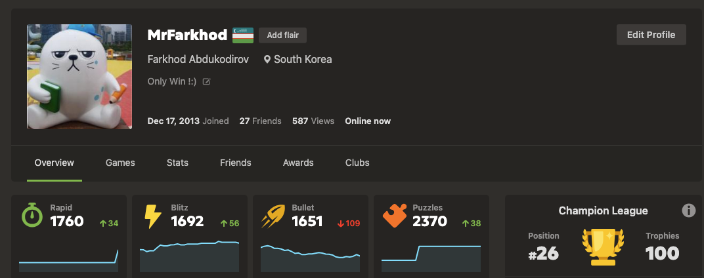
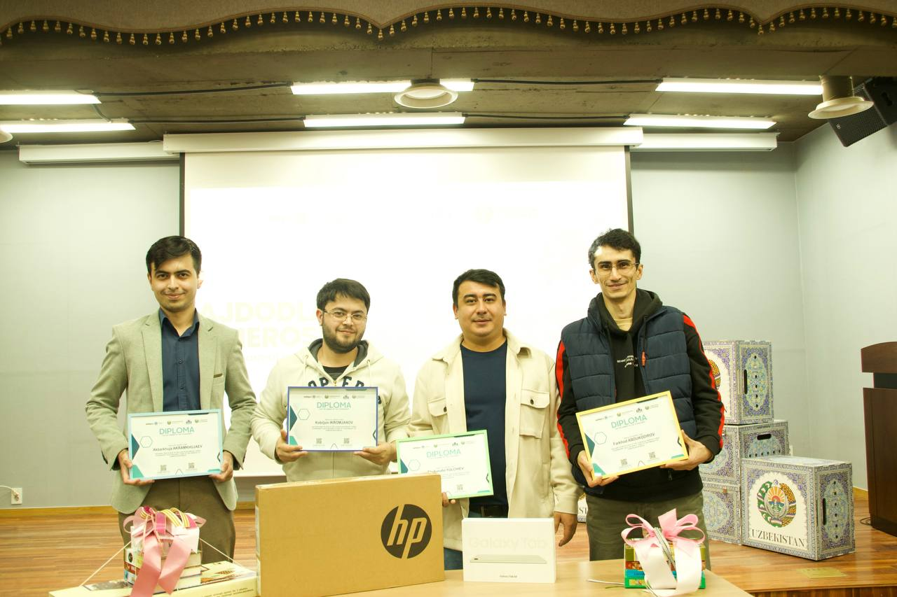
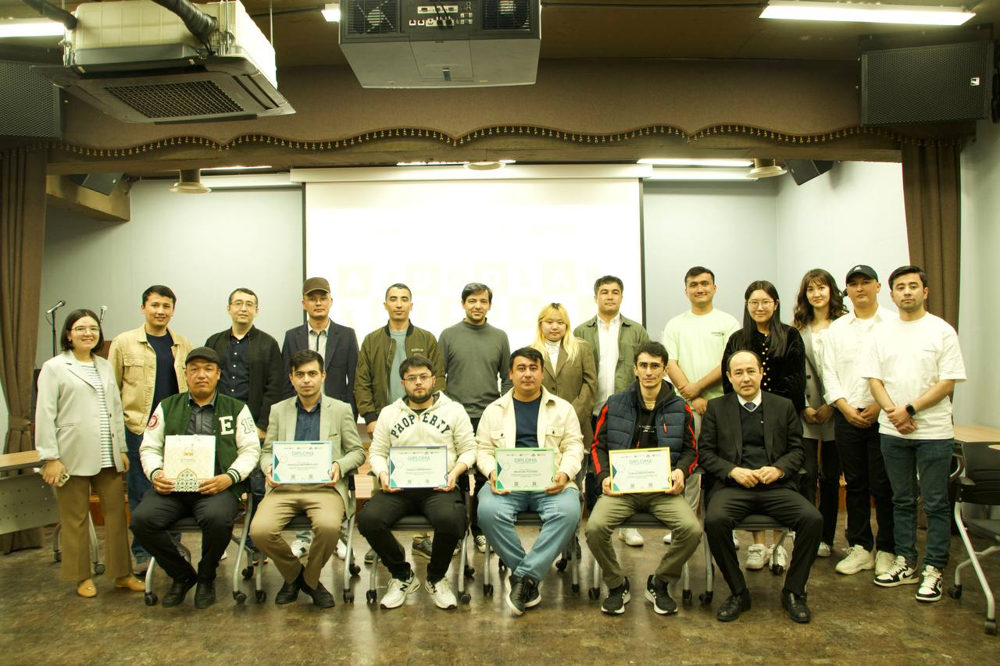
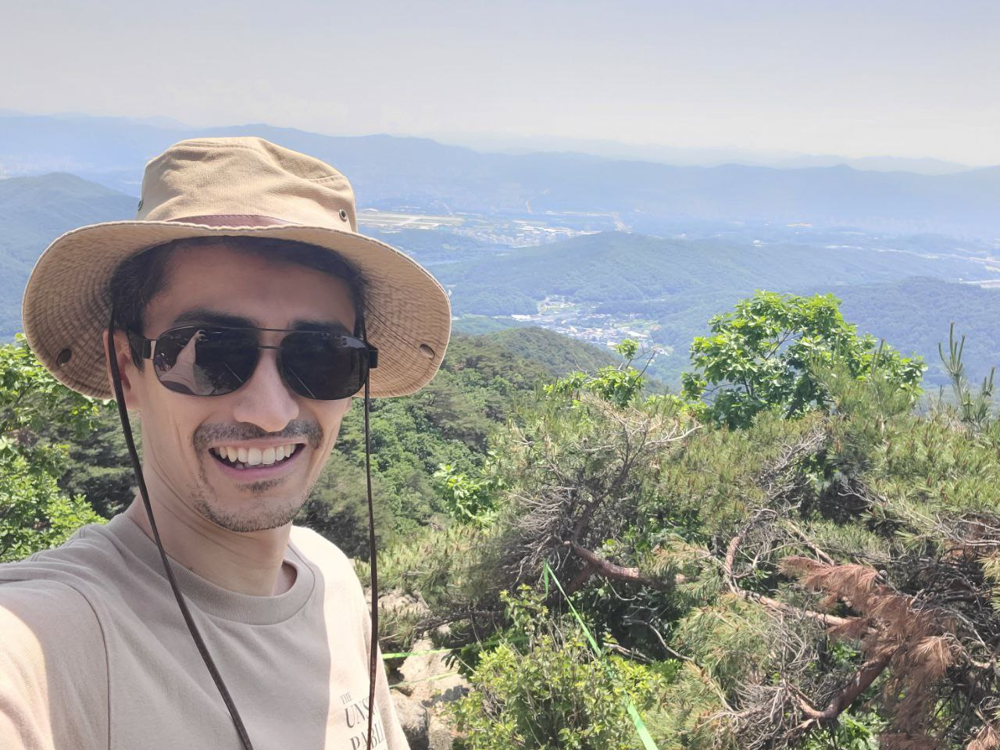
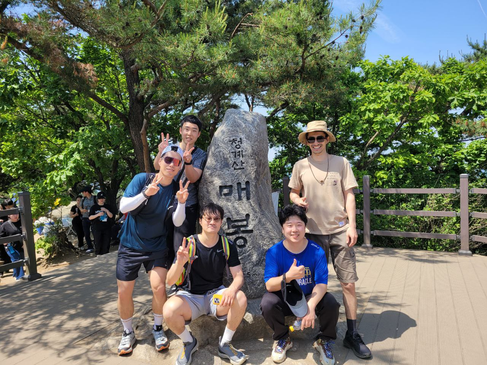

----

## ♟️ Chess 

- I like to play chess. 
- I'm <a href="https://www.chess.com/member/mrfarkhod" target="_blank"> member </a> of the <a href="https://www.chess.com/" target="_blank"> chess.com</a> since *Dec 17, 2013*

### 🏆 Chess Tournament Achievement

- Event Name: - <a href="https://admin.portal.gov.uz/oz/news/view/36785" target="_blank"> "Heritage of the Ancestors" Chess Tournament dedicated to the 687th anniversary of Amir Temur's birth in South Korea </a>
- Date: April 12, 2023
- Location: Embassy of Uzbekistan in South Korea
- Achievement: 4th Place Winner

---

## 🏔️ Hiking

- I do also like hiking
- Last time visited the <a href="https://namu.wiki/w/%EC%B2%AD%EA%B3%84%EC%82%B0" target="_blank"> Cheonggyesan (청계산) </a> with my team at <a href="https://www.cosmostation.io/" target="_blank"> Cosmostation </a>
- Date: June 5, 2025

